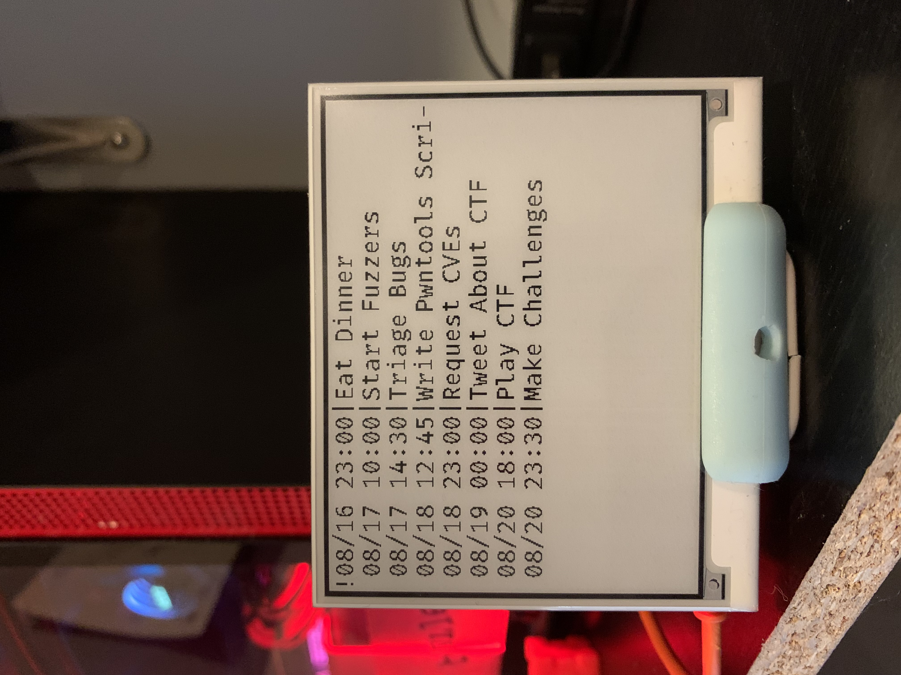

# Whatcalendar

This is a small modular program to display (for now, just a Google Calendar) on a Pimoroni Inky wHAT external display. The calendar paginates through upcoming events.

# Setup

First, create an app by following [this guide](https://developers.google.com/workspace/guides/create-credentials) to generate a `credentials.json` file. 

Then, edit `config.json` and replace placeholders with your configuration.

Run `setup.py` to generate `personal_token.json` to access the API.

Finally, copy `display.service` to `/etc/systemd/system/display.service` and run `sudo systemctl enable --now display` to start the program.